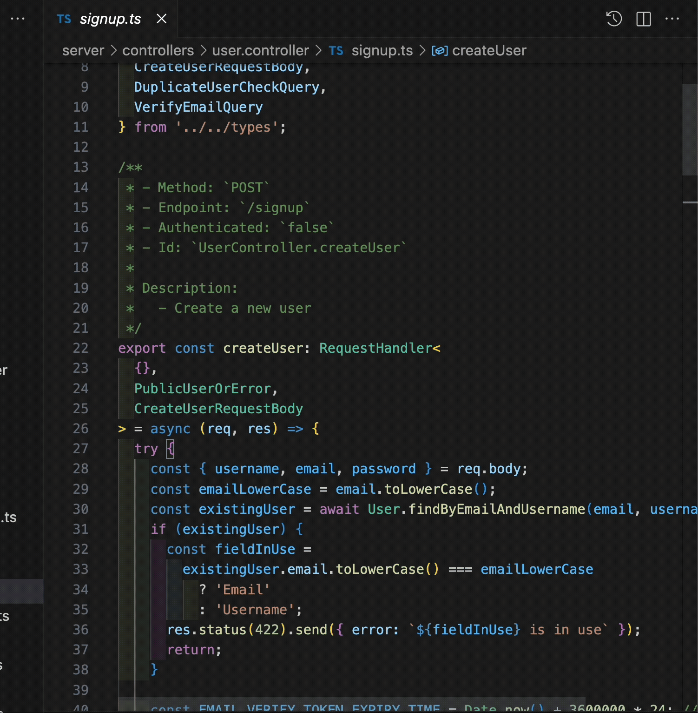
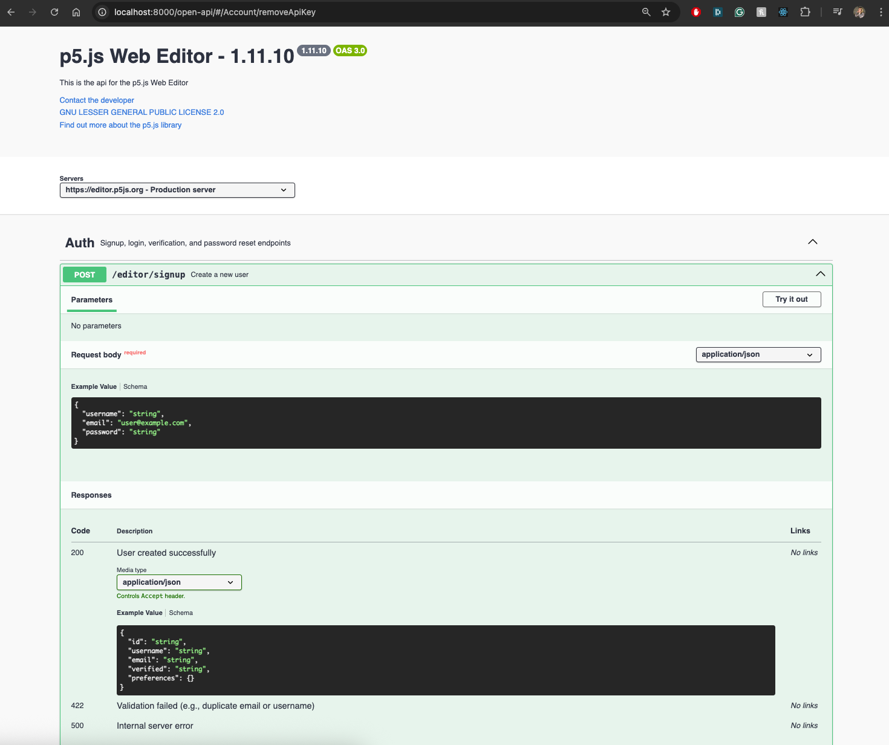

# pr05 2025 Typescript Migration

This is the project appendix for the **2025 pr05 Grant: Incremental Typescript Migration of the p5.js Web Editor**.

## Additional Reading:

- [All PRs related to the pr05 grant can be found with the `pr05` tag](https://github.com/processing/p5.js-web-editor/issues?q=state%3Aclosed%20label%3A%22pr05%20Grant%20Projects%22)
- [pr05 grant](https://github.com/processing/pr05-grant/wiki/2025-pr05-Program-Page)
- [pr05 grant: Typescript Migration Project](https://github.com/processing/pr05-grant/wiki/2025-pr05-Project-List#incremental-typescript-migration-for-the-p5js-editor)
- [Intro to the Incremental Typescript Migration for the p5.js Web Editor](https://medium.com/@clairepeng94/intro-to-the-incremental-typescript-migration-for-the-p5-js-web-editor-2ffbc305c6a9)

## Table of Contents

- [Project Outline](#project-outline)
  - [Context](#project-context)
  - [Proposed Approach](#proposed-approach)
  - [Project Timeline](#project-timeline)
  - [All PRs](#all-prs)
- [Summary of Outcome](#outcome)
- [Key Decisions](#key-decisions)
- [Summary of TS Configurations](#configuration-summary)
- [Migration Tutorial](#migration-tutorial)
- [Index of Migration Examples](#examples-index)
- [Next Step Issues](#next-step-issues)
- [Additional Reading](#additional-reading)

## Project Outline:

### Project Context:

<details open>
  <summary>View details</summary>

- Grant period of 200h over July 1st - October 31, 2025
- 116k lines of code within the repo, with about 30% test coverage
- Many older technologies, tied to Node 16 (bumped to Node 18 in August)

</details>

### Proposed Approach:

> To set up the repo so that beginning contributors can pick up migration work as a "Good first issue"

<details>
  <summary>Set up all config to be both TS & JS compatible</summary>

- Not possible to migrate entire repo within 200h
- Migration must also be file-by-file, so all config needs to be flexible to work with legacy JS code
- Key technologies:
  - Node
  - React
  - Express
  - MongoDB
  - Jest
  - Babel
  - Webpack
  - ESLint

</details>

<details>
  <summary>Set up typechecking tooling & automation
  </summary>

- Global typecheck command for both the `/server` and `/client` folders
- Isolated typecheck command for each the `/server` and `/client` folders
- Automated typecheck on pre-commit hook
- Automated typecheck on CICD tests

</details>

<details>
  <summary>
    Migrate an instance of each "kind" of file a developer might encounter to provide example code to follow
  </summary>

- Client:
  - React file
  - Plain TS file (eg. `/utils`)
- Server:
  - Mongoose Model --> `User`
  - Mongoose Controller --> `User.Controller`
  - Express Routes
  - Plain TS file (eg. `/utils`)
- Examples of writing tests for the above
- Example of extending namespaced types through `.d.ts` files

</details>

### Project Timeline:

Click to view details by month

<details>
  <summary>July:</summary>

- Set up TS dependencies & configuration on the `root`
  - `tsconfig.json`
  - `tsconfig.base.json`
  - `.babelrc`
  - `.eslintrc`
  - `package.json > jest.config`
  - `webpack/`
- Set up TS dependencies & configuration in `/client`
  - `/client/tsconfig.json`
  - `@types/...` for `/client` dependencies (eg. React 16)
- Set up `typecheck` and `typecheck:client` commands in `package.json`
- Migrate `/client/utils`

</details>

<details>
  <summary>August:</summary>

- Migrate `/client/common` with co-located types & tests
- Migrate `/client/components` with co-located types & tests

</details>

<details>
  <summary>September:</summary>

- Set up TS dependencies & configuration in `/server`
  - `nodemon.json`
  - `webpack/`
  - `/server/tsconfig.json`
  - `@types/...` for `/server` dependencies
- Set up `/server/types` to store all `/server` types (eg Mongoose v8)
- Migrate `/server` components related to emailing and `nodemailer`
- Migrate `/server/routes`
- Migrate `/server/models/User` with tests
- Migrate `/server/models/ApiKeys` with tests
- Start migrating `/server/controllers/User`

</details>

<details>
  <summary>October:</summary>

- Complete migration for `/server/controllers/User`
  - Added tests to all the methods & re-organised by sub-domain (eg. auth management) & added JSDocs for each controller method.
- Instantiate `.d.ts` files for `express` and `jest-express` to create a custome `Express` namespace `Request.User` definition
- Set up `/common/types` folder to
- Migrate root redux files: `/client/store`, `/client/reducers` & `/client/persistState`
- Migrate user preferences redux: `/client/IDE/reducers/preferences` & `/client/IDE/actions/preferences`
- Migrate `/client/modules/Legal`
- Migrate `/client/modules/About`
- Migrate most of `/client/modules/User` (with exception of files related to `Collections`)
- Clean up of previous work & documentation

</details>

## All PRs:

Click to view all PRs for this project:

<details>
  <summary>Click to view all PRs for this project:
  </summary>

- [pr05 Typescript #1: Set up TS dependencies in the root & client](https://github.com/processing/p5.js-web-editor/pull/3533)
- [pr05 Typescript #2: automatically resolve imports of ts files & migrate instance of client/utils file](https://github.com/processing/p5.js-web-editor/pull/3540)
- [pr05 Typescript #3: Migrate client/utils folder](https://github.com/processing/p5.js-web-editor/pull/3553)
- [pr05 Typescript #4: migrate instance of react file](https://github.com/processing/p5.js-web-editor/pull/3554)
- [pr05 Typescript Migration #5: Migrate client/common folder](https://github.com/processing/p5.js-web-editor/pull/3565)
- [pr05 Typescript Migration #6: Initial docs on typescript migration](https://github.com/processing/p5.js-web-editor/pull/3581)
- [pr05 Typescript Migration #7: migrate client components](https://github.com/processing/p5.js-web-editor/pull/3619)
- [pr05 Typescript #8: migrate client/components/Menubar/MenubarSubmenu](https://github.com/processing/p5.js-web-editor/pull/3623)
- [pr05 Typescript Migration #10: Setup Server TS Dependencies & migrate instance of server file](https://github.com/processing/p5.js-web-editor/pull/3636)
- [pr05 Typescript Migration #11: Migrate server/routes folder](https://github.com/processing/p5.js-web-editor/pull/3643)
- [pr05 Typescript Migration 12: Migrate server files related to emailing/nodemailer](https://github.com/processing/p5.js-web-editor/pull/3658)
- [pr05 Typescript Migration #13: Migrate the User Model (& API Key schema)](https://github.com/processing/p5.js-web-editor/pull/3672)
- [pr05 Typescript Migration #14: Migrate User Controller](https://github.com/processing/p5.js-web-editor/pull/3681)
- [pr05 Typescript Migration #15: Redux base files & migrate user preferences redux system](https://github.com/processing/p5.js-web-editor/pull/3683)
- [pr05 Typescript Migration #16: Fix build error webpack example config](https://github.com/processing/p5.js-web-editor/pull/3696)
- [pr05 Typescript Migration #17: Add typecheck to ci](https://github.com/processing/p5.js-web-editor/pull/3699)
- [Pr05 Typescript Migration #18: Migrate client/modules/About & client/modules/Legal](https://github.com/processing/p5.js-web-editor/pull/3702)
- [Pr05 Typescript Migration #19: client/common/icons](https://github.com/processing/p5.js-web-editor/pull/3703)
- [Pr05 Typescript Migration #20: Refine server/types & client/reducer types](https://github.com/processing/p5.js-web-editor/pull/3704)
- [Pr05 Typescript Migration #21: client/modules/User](https://github.com/processing/p5.js-web-editor/pull/3705)
- [pr05 Typescript Migration - Followon Project: Swagger / OpenApi documentation & UI for server routes](https://github.com/processing/p5.js-web-editor/pull/3706)

</details>

## Outcome:

Click to view details & relevant files per outcome-item

<details>
  <summary>All TS-related configuration for dependencies is completed</summary>

- `tsconfig.json`
- `tsconfig.base.json`
- `.babelrc`
- `.eslintrc`
- `package.json > jest.config`
- `webpack/`
- `nodemon.json`
- `/client/tsconfig.json`
- `/server/tsconfig.json`
</details>

<details>
  <summary>Typecheck commands have been set up & enabled on automated checks locally and on CI</summary>

- `npm run typecheck` to check both the `/server` and `/client` folders
- `npm run typecheck:server` to check only the `/server` folder
- `npm run typecheck:client` to check only the `/client` folder
- `package.json > husky` configured to run `npm run typecheck` during `pre-commit` check
- `/github/workflows/test.yml` configured to run `npm run typecheck` during `test` on GHA

</details>

<details>
  <summary>The following files have been migrated, covering at least once instance of each 'kind' of file encountered on the repo:</summary>

- [x] `/common/types`
- [.] `/client/`:
  - [x] `/client/utils/`
  - [x] `/client/common/`
  - [x] `/client/components/`
  - [x] `/client/store`
  - [x] `/client/reducers`
  - [x] `/client/persistState`
  - [x] `/client/IDE/reducers/preferences`
  - [x]`/client/IDE/actions/preferences`
  - [x] `/client/modules/User/`
  - [x] `/client/modules/About/`
  - [x] `/client/modules/Legal/`
  - [x] `/client/custom.d.ts`
- [.] `/server`:
  - [.] `/server/controllers`
    - [x] `/server/controllers/user.controller/`
  - [.] `/server/models/`
    - [x] `/server/models/user`
    - [x] `/server/models/apiKey`
  - [x] `/server/routes/`
  - [x] `/server/middleware/`
  - [x] `/server/types/`
  - [x] `/server/views/`
- [.] `/server/utils/`
  - [x] `/server/utils/generateFileSystemSafeName`
  - [x] `/server/utils/mail`
  - [x] `/server/utils/renderMjml`

</details>

## Key Decisions:

<details>
  <summary>
    Typescript is configured to be used for type checking only, not for transpiling
  </summary>

```shell
npm run tsc --noEmit
```

- The repo is too large to convert entirely to TS in one go, so we need to flexibly support both TS and JS files
- We have existing legacy runtime build tools (Babel & Webpack) for the existing JS, so this was the easiest way to support both our intended direction and legacy codebase
- Our configured automated type checking prevents PRs from being merged if they fail, so we're working towards a Typescript system without disrupting current build.
- Once the repo has been migrated, we can update to full transpilation with `npm run tsc`

</details>

<br>

<details>
  <summary>
    Prefer `named` exports over `default` exports where possible
  </summary>

❌ DON'T:

```ts
// calculator.ts
export default function multiply(a: number, b: number): numer {
  return a * b;
}

// main.ts
import calculate from './calculator'; // the default function is renamed and confusing for next dev to read

console.log(calculate(2, 2)); // is this 2*2? 2+2? 2^2? something else?
```

✅ DO:

```ts
// calculator.ts
export function multiply(a: number, b: number): numer {
  return a * b;
}

// main.ts
import { multiply } from './calculator';

console.log(multiply(2, 2));
```

- Default exports allow devs to rename the import anything they want, and inaccurate misnaming will cause confusion
- Renaming default export also makes it more difficult to perform a global search on the function

</details>

<details>
  <summary>
  Prefer `interface` over `type`
  </summary>

```tsx
// ✅ interface
interface ButtonProps {
  label: string
  disabled?: boolean
  onClick: () => void
}
const Button = ({ label, disabled, onClick }: ButtonProps) => (...)

// ❌ type
type ButtonProps = {
  label: string
  disabled?: boolean
  onClick: () => void
}

// ✅ keep type for primitives
type UserId = string;
```

- Clearer semantic meaning when describing structured objects vs. primitives
- This is not strictly enforced in linting rules, but aims to align with [Google Typescript styling](https://google.github.io/styleguide/tsguide.html#prefer-interfaces). Please see attached link for details.

</details>

<br>

<details>
  <summary>
  If possible, add unit tests prior to the component that you are migrating prior to performing any migration
  </summary>

- This protects the app from unintended regression & also helps demonstrate to reviewers that you understand the intent of a component/file you are migrating
- Tests also help document how the component is intended to work.
- Please see [testing](../testing.md) for more details on general guidelines, or the example code index below.

</details>

<details>
  <summary>
    If a component does not have an existing unit test, keep refactors/logic changes outside of Typescript Migration PRs
  </summary

- This helps keep reviews easy for maintainers
- Branch off the migration PR and make a subsequent PR with your proposed refactor.

</details>

<br>

<details>
  <summary>
    Add JSDocs & specify the `Express` `RequestHandler` generics to `/server` controller methods in the following example:
  </summary>

```ts
// see server/controllers/user.controller/userPreferences.ts

/**
 * - Method: `PUT`
 * - Endpoint: `/preferences`
 * - Authenticated: `true`
 * - Id: `UserController.updatePreferences`
 *
 * Description:
 *   - Update user preferences, such as AppTheme
 */
export const updatePreferences: RequestHandler<
  {}, // request params type if there are any, extending RouteParam
  UpdatePreferencesResponseBody, // response body type
  UpdatePreferencesRequestBody // request body type
  // query params type if there are any
> = async (req, res) => {
  // ... rest of code
};
```

- JSDocs will reduce cognitive load for other developers and enable them to see the controllers details on hover.
- Add the JSDocs to any `client` controllers that use these endpoints.



</details>

<br>

<details>
  <summary>
  Best-effort & evolving-precision principle towards defining types
  </summary>

- Because we are adding types into a legacy project originally written without types, there are sometimes inconsistencies between component contracts, or misalignments between type shapes or name conventions that make adding in types difficult.
- As such make a best effort at being as precise as possible with context clues, but when in doubt, selecting a broader type (eg. `string` instead of an `enum`) is valid and we can update to be stricter as the migration continues.

</details>

<br>

<details>
  <summary>
    `/server` types live in `/server/types`. `/client` types are co-located (currently). Shared types between the `/server` and `/client` live in `/common/types`.  
  </summary>

- `/server` types are in `/types` folder
  - These types should serves the source-of-truth for the rest of the app.
- Pull any types that are relevant to share with the `./client` into the `./common/types` folder
- `/client` types are co-located for now
  - Components have their own types so they will get very numerous and messy
  - However this is open to proposals for change

</details>

## Configuration Summary:

<details>
  <summary>
    Relevant PRs
  </summary>

- [pr05 Typescript #1: Set up TS dependencies in the root & client](https://github.com/processing/p5.js-web-editor/pull/3533)
- [pr05 Typescript #2: automatically resolve imports of ts files & migrate instance of client/utils file](https://github.com/processing/p5.js-web-editor/pull/3540)
- [pr05 Typescript Migration #10: Setup Server TS Dependencies & migrate instance of server file](https://github.com/processing/p5.js-web-editor/pull/3636)
- [pr05 Typescript Migration #15: Redux base files & migrate user preferences redux system](https://github.com/processing/p5.js-web-editor/pull/3683)
- [pr05 Typescript Migration #16: Fix build error webpack example config](https://github.com/processing/p5.js-web-editor/pull/3696)
- [pr05 Typescript Migration #17: Add typecheck to ci](https://github.com/processing/p5.js-web-editor/pull/3699)

</details>

## Migration Tutorial:

[Video Guide - Migrating the `client/modules/User/pages/AccountView`](youtube.com/watch?v=y84SVy7lAgg&feature=youtu.be)

<summary>
  <details>
    <summary>
      Text Guide
    </summary>
    TO DO
  </details>
</summary>

## Examples Index:

### Client Files:

<details>
  <summary>React component</summary>

- [IconButton](https://github.com/processing/p5.js-web-editor/blob/develop/client/common/IconButton.tsx)
- [IconButton test](https://github.com/processing/p5.js-web-editor/blob/develop/client/common/IconButton.test.tsx)

</details>

<details>
  <summary>Normal TS file</summary>

- [formatDate](https://github.com/processing/p5.js-web-editor/blob/develop/client/utils/formatDate.ts)
- [formateDate test](https://github.com/processing/p5.js-web-editor/blob/develop/client/utils/formatDate.test.ts)

</details>

<details>
  <summary>Hook</summary>

- [usePrevious](https://github.com/processing/p5.js-web-editor/blob/develop/client/common/usePrevious.ts)
- [usePrevious test](https://github.com/processing/p5.js-web-editor/blob/develop/client/common/usePrevious.test.ts)

</details>

<details>
  <summary>Redux</summary>

- To be updated pending open PR

</details>

<details>
  <summary>Custom type declaration file</summary>

- [custom.d.ts](https://github.com/processing/p5.js-web-editor/blob/develop/client/custom.d.ts)
  - Use this to extend any client namespaced types (eg. Window) or file extensions (.svg, .mp3)

</details>

### Server Files:

<details>
  <summary>Types are extracted into /server/types in a barrel structure</summary>
  
  - [types/userPreferences](https://github.com/processing/p5.js-web-editor/blob/develop/server/types/userPreferences.ts)
  - [types/index](https://github.com/processing/p5.js-web-editor/blob/develop/server/types/index.ts)
    - All server types are exported here

</details>

<details>
  <summary>Routes</summary>

- [routes/user.routes.ts](https://github.com/processing/p5.js-web-editor/blob/develop/server/routes/user.routes.ts)
  - Format the routes by 'subdomain' if the file is particularly large
  - Add the method & path in code comments for easier global search

</details>

<details>
  <summary>Model</summary>

- [models/user](https://github.com/processing/p5.js-web-editor/blob/develop/server/models/user.ts)
- [models/user test](https://github.com/processing/p5.js-web-editor/blob/develop/server/models/__test__/user.ts)

</details>

<details>
  <summary>Controller</summary>

- [controllers/user.controller > index file](https://github.com/processing/p5.js-web-editor/blob/develop/server/controllers/user.controller/index.ts)
  - Note that controllers should be organised in barrel format with an index file.
- [controllers/user.controller > updateSettings method](https://github.com/processing/p5.js-web-editor/blob/develop/server/controllers/user.controller/userPreferences.ts)
- [controllers/user.controller > updateSettings method test](https://github.com/processing/p5.js-web-editor/blob/develop/server/controllers/user.controller/__tests__/userPreferences.test.ts)

</details>

<details>
  <summary>Custom type declaration for a namespace for a dependency</summary>
  
  - [types/express](https://github.com/processing/p5.js-web-editor/blob/develop/server/types/express/index.d.ts)
    - Extend the `express` namespace `Request.User` with a custom user type.
  - [types/jest-express](https://github.com/processing/p5.js-web-editor/blob/develop/server/types/jest-express/index.d.ts)
    - Parallel change on `jest-express` to extend `Request.User` in the test environment

</details>

### Common Files:

<details>
  <summary>Types shared across the server to client are exported in /common/types</summary>
  
  - [types/index](https://github.com/processing/p5.js-web-editor/blob/develop/common/types/index.ts)
    - Note that for some APIs (eg. user) we don't want to export **all** types, we want to specifically name the types to share with the client (eg. not `UserDocument`)

</details>

## Next Step Issues:

<details>
  <summary>Migrate the rest of the repo to Typescript</summary>

- [Issue Link - TODO]()

- Prioritise `/server` if possible
- Testing is mandatory for `/server` migration
- For `/client` files, if the component does not hit the `/server` api, it is ready for migration.
- If it does it is recommended to wait for the relevant `/server` system to be migrated first (eg. Projects, Collections)

</details>

<details>
  <summary>Add end-to-end tests to cover the core user flows</summary>

- [Issue Link - TODO]()

- Writing a suite of e2e tests to cover core user flows would enable security against regression with fewer test files necessary
- This can be done with Playwrite or Cypress & can be integrated into CICD pipelines.
- Examples of core user flows include:
  - `User can log in`
  - `User can save a sketch & see it in their sketches`
- To be discussed further with the contributor community.

</details>

<details>
  <summary>Create a OpenAPI/Swagger documentation microsite for the server APIs</summary>



- [Swagger.ui](https://swagger.io/tools/swagger-ui/)
- [Issue Link - TODO]()

- This would enable new contributors to have a centralised location to look for APIs
- Also aligns with current API documentation standards as of 2025
- Current API documentation lives [here](https://github.com/processing/p5.js-web-editor/blob/develop/contributor_docs/public_api.md) and does not contain all the APIs
- [Proof of concept PR here](https://github.com/processing/p5.js-web-editor/pull/3706)
  - I have written out the User related APIs by hand, but ideally we would have automation to check that this document is accurate, or to autogenerate the document, or autogenerate types & routes from the document.

</details>
