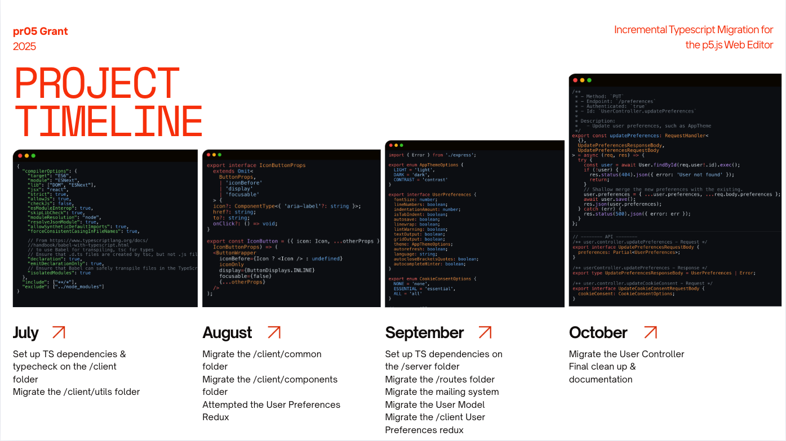

# pr05 2025 Typescript Migration

This is the project appendix for the **2025 pr05 Grant: Incremental Typescript Migration of the p5.js Web Editor**.

## Table of Contents

## Project Outline:

### Project Background:

  
View details

- Grant period of 200h over July 1st - October 31, 2025
- 116k lines of code within the repo, with about 30% test coverage
- Many older technologies, tied to Node 16 (bumped to Node 18 in August)

### Proposed Approach:

> To set up the repo so that beginning contributors can pick up migration work as a "Good first issue"

  
Set up all config to be both TS & JS compatible

- Not possible to migrate entire repo within 200h
- Migration must also be file-by-file, so all config needs to be flexible to work with legacy JS code
- Key technologies:
  - Node
  - React
  - Express
  - MongoDB
  - Jest
  - Babel
  - Webpack
  - ESLint

  
Set up typechecking tooling & automation
  

- Global typecheck command for both the `/server` and `/client` folders
- Isolated typecheck command for each the `/server` and `/client` folders
- Automated typecheck on pre-commit hook
- Automated typecheck on CICD tests

  

    Migrate an instance of each "kind" of file a developer might encounter to provide example code to follow
  

- Client:
  - React file
  - Plain TS file (eg. `/utils`)
- Server:
  - Mongoose Model --> `User`
  - Mongoose Controller --> `User.Controller`
  - Express Routes
  - Plain TS file (eg. `/utils`)
- Examples of writing tests for the above
- Example of extending namespaced types through `.d.ts` files

### Project Timeline:

## Outcome:

- Root TS config that points to separate TS and

## Key Decisions:

- Typescript is used for typechecking only, not compiling

- Define "source-of-truth" types in the `./server/types` folder

  - Pull any types that are relevant to share with the `./client` into the `./common/types` folder

- Prefer `named` exports over `default` exports

- JSDocs for API endpoints & client components that hit API endpoints

  - Will eventually migrate to OpenAPI/Swagger documentation
  - Enables devs to hover and see details more easily

- Prefer `interface` over `type`

- `/server` types are in `/types` folder
- `/client` types are co-located for now -- pending change

  - Components have their own types so they get messy

- If using code-assistance, make sure to write unit tests that cover all happy/unhappy paths to secure against regression. Please see [testing](../testing.md) for more details on general guidelines, or the example code index below.

- Make a best effort at being as precise as possible with context clues, but when in doubt, selecting a broader type (eg. `string` instead of an `enum`) is valid and we can update to be stricter as the migration continues.

## Configuration Summary:

## Migration Tutorial:

## Examples Index:

## Next Step Issues:

- Migration for the rest of the repo

  - Prioritise `/server` if possible
  - Testing is mandatory for `/server` migration
  - For `/client` files, if the component does not hit the `/server` api, it is ready for migration.
  - If it does it is recommended to wait for the relevant `/server` system to be migrated first (eg. Projects, Collections)

- E2e test to cover core user flows
- Open API

## Additional Reading:

- [pr05 grant](https://github.com/processing/pr05-grant/wiki/2025-pr05-Program-Page)
- [pr05 grant: Typescript Migration Project](https://github.com/processing/pr05-grant/wiki/2025-pr05-Project-List#incremental-typescript-migration-for-the-p5js-editor)
- [Intro to the Incremental Typescript Migration for the p5.js Web Editor](https://medium.com/@clairepeng94/intro-to-the-incremental-typescript-migration-for-the-p5-js-web-editor-2ffbc305c6a9)
